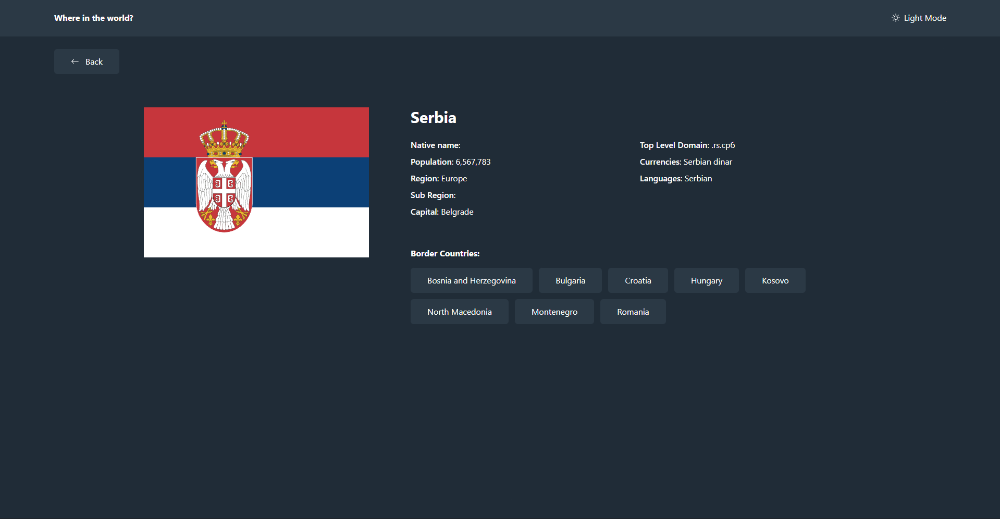

# REST Countries API with Color Theme Switcher

A modern, responsive web application that displays information about countries worldwide. Built with React, TypeScript, and Tailwind CSS, this application fetches data from the REST Countries API and provides an intuitive interface for exploring countries with advanced filtering and search capabilities.

This is a solution to the [REST Countries API with color theme switcher challenge on Frontend Mentor](https://www.frontendmentor.io/challenges/rest-countries-api-with-color-theme-switcher-5cacc469fec04111f7b848ca).

## Table of Contents

- [Overview](#overview)
  - [The Challenge](#the-challenge)
  - [Features](#features)
  - [Screenshots](#screenshots)
  - [Links](#links)
- [Getting Started](#getting-started)
  - [Prerequisites](#prerequisites)
  - [Installation](#installation)
  - [Running the Project](#running-the-project)
- [Tech Stack](#tech-stack)
- [Key Features & Implementation](#key-features--implementation)
- [What I Learned](#what-i-learned)
- [Author](#author)

## Overview

### The Challenge

Users should be able to:

- See all countries from the API on the homepage
- Search for a country using an `input` field
- Filter countries by region
- Click on a country to see more detailed information on a separate page
- Click through to the border countries on the detail page
- Toggle the color scheme between light and dark mode

### Features

- **Global Country Database**: Browse and explore detailed information about all countries
- **Advanced Search**: Real-time search functionality powered by Fuse.js for fast, fuzzy matching
- **Regional Filtering**: Filter countries by continent/region
- **Country Details**: View comprehensive information including:
  - Capital city, native name, and official name
  - Population, area, and language(s)
  - Currency information
  - Border countries with clickable navigation
- **Theme Switcher**: Toggle between light and dark modes for comfortable viewing
- **Responsive Design**: Fully responsive layout that works seamlessly on mobile, tablet, and desktop
- **Performance Optimized**: Efficient state management with Context API and React Query for data fetching

### Screenshots

**Countries List View**


**Country Details View**


### Links

- **Repository**: [https://github.com/molinax18/fm-rest-countries](https://github.com/molinax18/fm-rest-countries)
- **Live Demo**: [https://molinax18.github.io/fm-rest-countries/](https://molinax18.github.io/fm-rest-countries/)
- **Frontend Mentor Challenge**: [https://www.frontendmentor.io/profile/molinax18](https://www.frontendmentor.io/profile/molinax18)

## Getting Started

### Prerequisites

- Node.js (v16 or higher)
- npm or yarn

### Installation

1. Clone the repository:

```bash
git clone https://github.com/molinax18/fm-rest-countries.git
cd fm-rest-countries
```

2. Install dependencies:

```bash
npm install
```

### Running the Project

**Development mode:**

```bash
npm run dev
```

The application will start at `http://localhost:5173`

**Build for production:**

```bash
npm run build
```

**Preview production build:**

```bash
npm run preview
```

**Deploy to GitHub Pages:**

```bash
npm run deploy
```

## Tech Stack

- **Frontend Framework**: [React 19](https://react.dev/) - Modern UI library with latest features
- **Language**: [TypeScript](https://www.typescriptlang.org/) - Type-safe JavaScript
- **Build Tool**: [Vite](https://vitejs.dev/) - Next generation frontend tooling
- **Styling**: [Tailwind CSS 4](https://tailwindcss.com/) - Utility-first CSS framework
- **Data Fetching**: [React Query](https://tanstack.com/query/latest) - Powerful server state management
- **Search**: [Fuse.js](https://fusejs.io/) - Lightweight fuzzy-search library
- **Icons**: [React Icons](https://react-icons.github.io/react-icons/) - Icon library
- **Code Quality**: [ESLint](https://eslint.org/) & [Prettier](https://prettier.io/)
- **Deployment**: [GitHub Pages](https://pages.github.com/)

## Key Features & Implementation

### State Management with Context API

The application uses React Context API to manage global state:

- **ThemeContext**: Handles light/dark mode switching
- **CountriesContext**: Manages countries data, filtering, and search
- **NavigationContext**: Manages page navigation and routing
- **DropdownContext**: Manages dropdown component state

### Search and Filter

- Implemented fuzzy search using Fuse.js for better user experience
- Real-time filtering by country name and region
- Optimized performance with debouncing and memoization

### Responsive Design

- Mobile-first approach using Tailwind CSS
- Responsive grid layout for country cards
- Touch-friendly interface for all devices

### API Integration

- Fetches data from the [REST Countries API](https://restcountries.com/)
- Implements error handling and loading states
- Efficient caching with React Query

## What I Learned

- **Advanced React Patterns**: Context API, custom hooks, and component composition
- **TypeScript**: Type safety and better developer experience with strict typing
- **State Management**: Effective data flow management without external libraries
- **Tailwind CSS**: Utility-first CSS approach for rapid UI development
- **Performance Optimization**: Lazy loading, memoization, and efficient re-rendering
- **Modern Build Tools**: Vite's speed and hot module replacement
- **Testing Edge Cases**: Handling API errors, loading states, and empty results
- **Accessibility**: Building inclusive UI components for all users
- **GitHub Pages Deployment**: Hosting static sites with custom domain configuration

## Author

- **LinkedIn**: [https://www.linkedin.com/in/ariel-molina-ortiz-b1a443271/](https://www.linkedin.com/in/ariel-molina-ortiz-b1a443271/)
- **GitHub**: [https://github.com/molinax18](https://github.com/molinax18)
- **Frontend Mentor**: [https://www.frontendmentor.io/profile/molinax18](https://www.frontendmentor.io/profile/molinax18)
